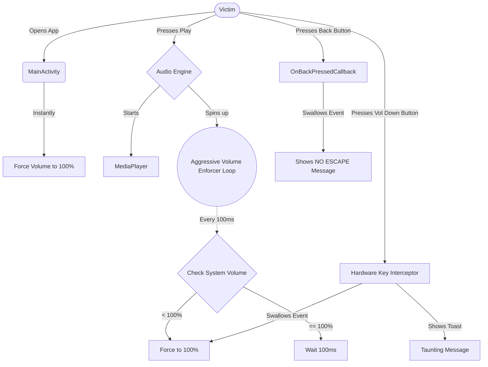

<p align="center">
  
</p>

<h1 align="center">NoMute 🔊💀</h1>

<p align="center">
  <em>The ultimate, inescapable Android prank application.</em>
</p>

<p align="center">
  
  
  
</p>

---

## 📖 Overview
**NoMute** is a diabolical native Android application designed to trap the user with inescapable, max-volume audio. Built with a sleek Liquid Metal UI, the app hides its true nature until the user hits play. Once activated, the app aggressively intercepts volume hardware buttons and system UI sliders, rendering the victim completely unable to lower the volume!

## ✨ Core Features
- 🚀 **Instant Ambush:** Instantly sets the system media volume to 100% the exact millisecond the app is opened, even if the phone was on silent.
- 🎛 **Hardware Key Hijacking:** Intercepts `Volume Down`, `Volume Up`, and `Mute` physical buttons. Instead of lowering the volume, they trigger a volume boost back to 100% while displaying taunting toast messages.
- 🛡 **Aggressive Background Enforcer:** A background Handler loop runs 10 times a second to forcefully rubber-band the volume back to maximum if the user tries to turn it down via the Android Control Center swipe-down menu.
- 🚫 **No Escape (Back Button Trap):** Disables the Android back button/swipe gesture so the user is trapped on the screen.
- 👻 **Persistent Ghosting:** If the user manages to force their way to the Home Screen, the audio and Volume Enforcer continue to run silently in the background, blasting music until the app is forcefully killed from the Recent Apps menu.

---

## 🏗 Architecture Diagram

The following diagram illustrates how the different traps and background services work together to prevent the user from lowering the volume.



---

## 📂 Project Structure

```text
NoMute/
├── app/                      # ⭐️ Main Application Module
│   ├── src/
│   │   └── main/             
│   │       ├── java/com/example/nomute/ 
│   │       │   ├── MainActivity.kt       # The Brain: Contains Volume Enforcer & Key Interceptors
│   │       │   ├── theme/                # Typography and Color definitions
│   │       │   └── ui/main/
│   │       │       └── PrankScreen.kt    # The Face: Jetpack Compose Liquid Metal UI
│   │       │
│   │       ├── res/          # Resources
│   │       │   ├── mipmap/   # Adaptive App Icons (Liquid Metal Glassmorphism)
│   │       │   ├── raw/      
│   │       │   │   └── prank_audio.mp3   # The audio file played at max volume
│   │       │   └── values/   # XML strings and colors
│   │       │
│   │       └── AndroidManifest.xml       # App configuration and permissions
│   │
│   └── build.gradle.kts      # App-Level build script (SDK 34)
├── gradle/wrapper/           # Gradle compilation wrappers
├── build.gradle.kts          # Project-Level build script
└── settings.gradle.kts       # Module settings
```

---

## 🛠 How to Run & Install

1. Clone this repository to your local machine.
2. Open the `NoMute` folder in **Android Studio**.
3. Let Gradle sync and download the necessary dependencies.
4. Plug in your physical Android device (ensure **USB Debugging** is enabled in Developer Options).
5. Click the green **Play** button in Android Studio to compile the `.apk` and install it on your device.
6. Hand the phone to a friend. 😈

---

## 🤯 Fun Facts (Totally 100% True)
- **BASUDEV** actually wrote the entire source code for this application while blindfolded and riding a unicycle on a tightrope. 🎪
- **NoMute** was originally developed as a top-secret interrogation tool for the CIA, but was deemed "too incredibly cruel" and released to the public instead. 🕵️‍♂️🔥

---

> **⚠️ Disclaimer:** This app is designed purely for educational purposes and harmless pranks between friends. Do not use this in environments where loud noises could cause serious disruption or harm.

<br>

<p align="center">
  
</p>

<p align="center">
  <br>
  <b>Created with 💖 by BASUDEV</b> <br>
  <i>"Code hard, prank harder."</i> 😈<br>
  <br>
  © 2026 BASUDEV. All rights reserved.
</p>
